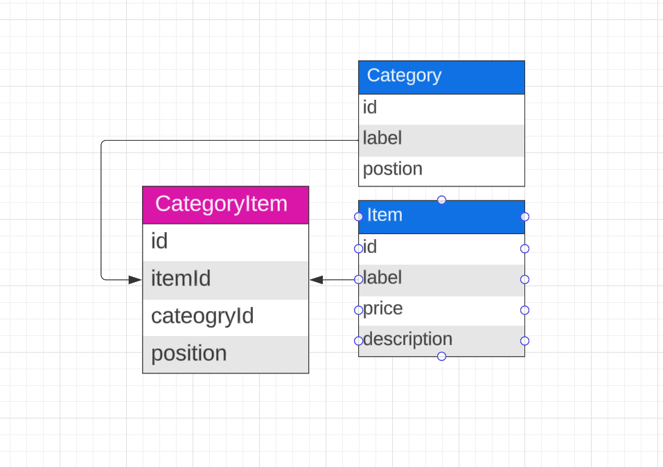
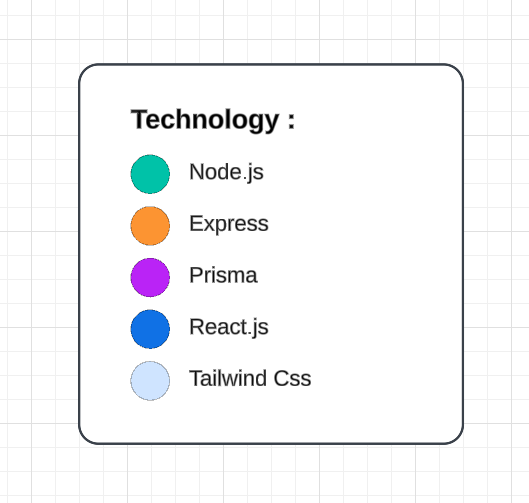
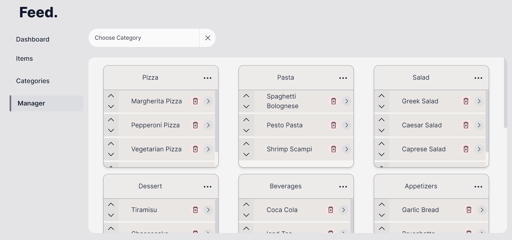
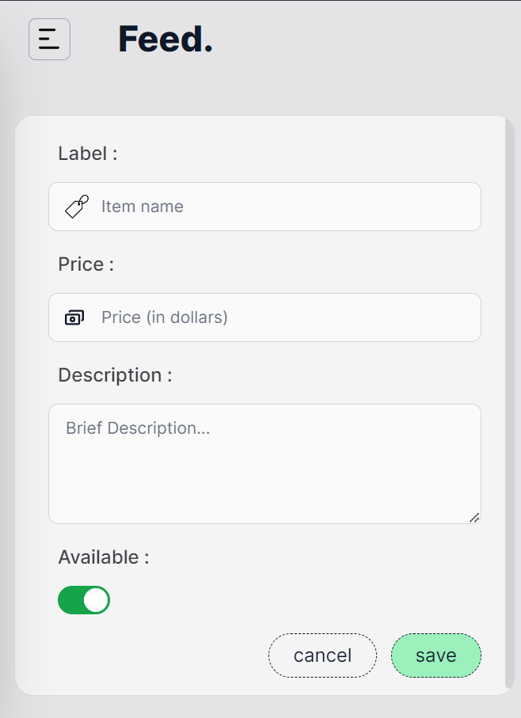
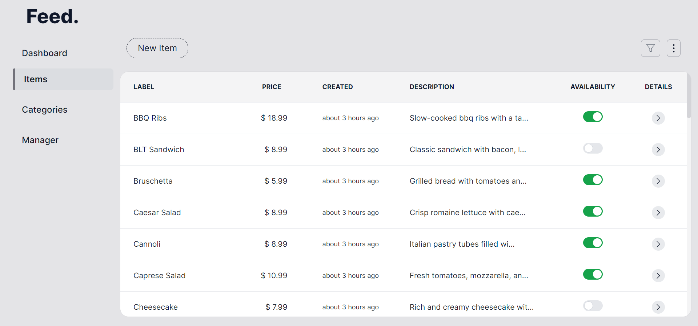
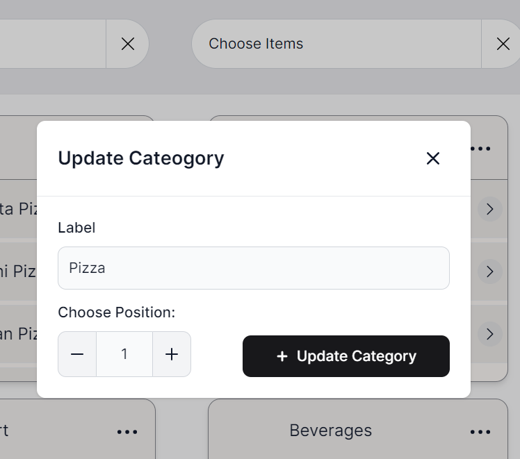
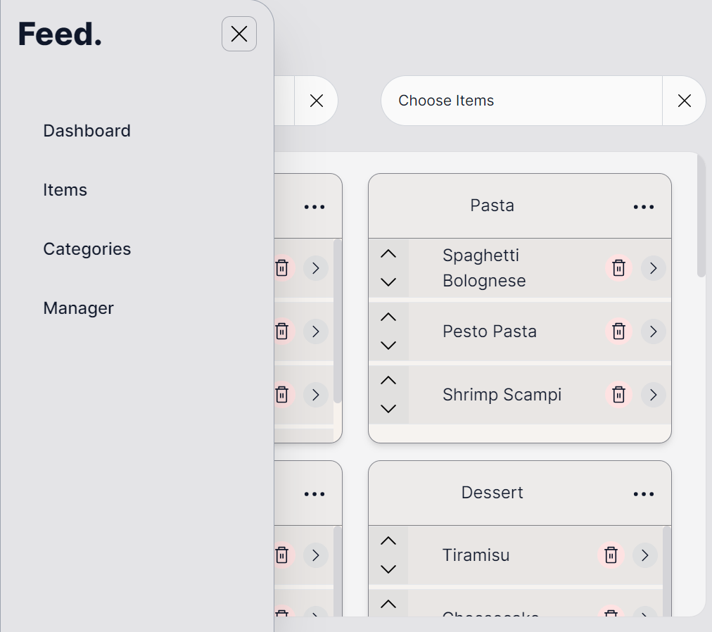

# Feed

<p align="center">
  
</p>

## By [AYMANE ATIGUI](https://github.com/aymaneatigui).

- Website - [https://atigui.tech](https://www.atigui.tech)
- Linkedin - [aymaneatigui](https://www.linkedin.com/in/aymane-atigui)
- Github - [aymaneatigui](https://github.com/aymaneatigui)
- Twitter - [@aymane_atigui](https://twitter.com/aymane_atigui)

## Table of Contents

- [Feed](#feed)
- [Table of Contents](#table-of-contents)
- [Setup](#setup)
- [Data Modeling and Technology used](#data-modeling-and-technology-used)
- [Screenshot](#screenshot)

# Setup

## System requirements

This project requires the following software to be correctly installed on your system.

- `node v20.9`
- `npm  10.2.3`

## Server-Side Configuration

This project uses `MongoDB` with `Prisma`. You need to create a database called `feed`.

First, navigate to the server side of the project in your terminal. Then, install all the dependencies by running:

```bash
cd server
npm install
```

Create a `.env` file in the server side of the project and include your database link and Port.
The `.env` file should look something like this:

```bash

PORT=3001
DATABASE_URL="mongodb+srv://<username>:<password>@cluster.mongodb.net"
```

Replace `DATABASE_URL` with the actual link to your MongoDB database.

Create the Prisma client and push the database by running:

```bash
npx prisma db push
```

## Client-Side Configuration

Then, navigate to the client side in your terminal and do the same:

```bash
cd client
npm install
```

## Running the Project

After installing all the dependencies, you can start the project by using:

```bash
cd server
npm run dev
```

<small>for Start the server</small>

```bash
cd client
npm run dev
```

<small>for Start the client</small>

The project should now be up and running! If you encounter any issues, feel free to reach out to me. I am more than happy to assist you.

# Data Modeling and Technology used

<div style="display: flex; align-items: flex-start; justify-content: center;">
  
  
</div>

# Screenshot

<p align="center">
  
</p>

<div style="display: flex; align-items: center; justify-content: center;">
    
  

</div>

<p align="center">
  
</p>

<div style="display: flex; align-items: center; justify-content: center;">
  
    

</div>
